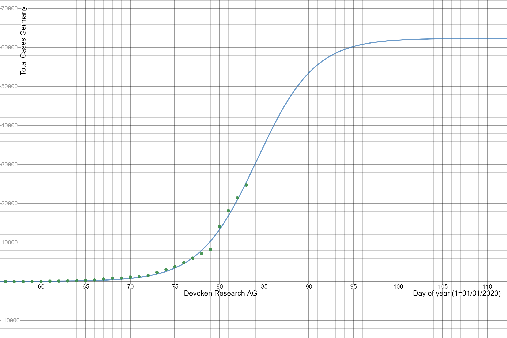
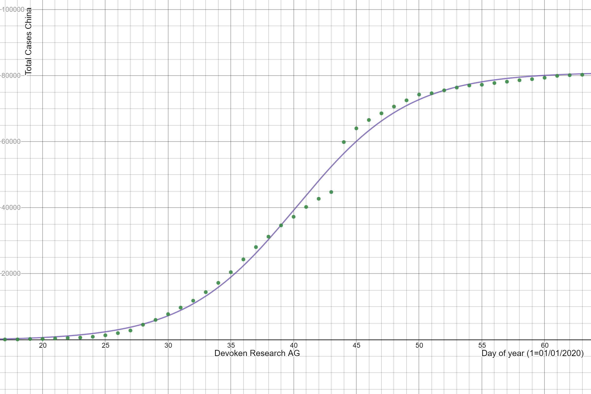
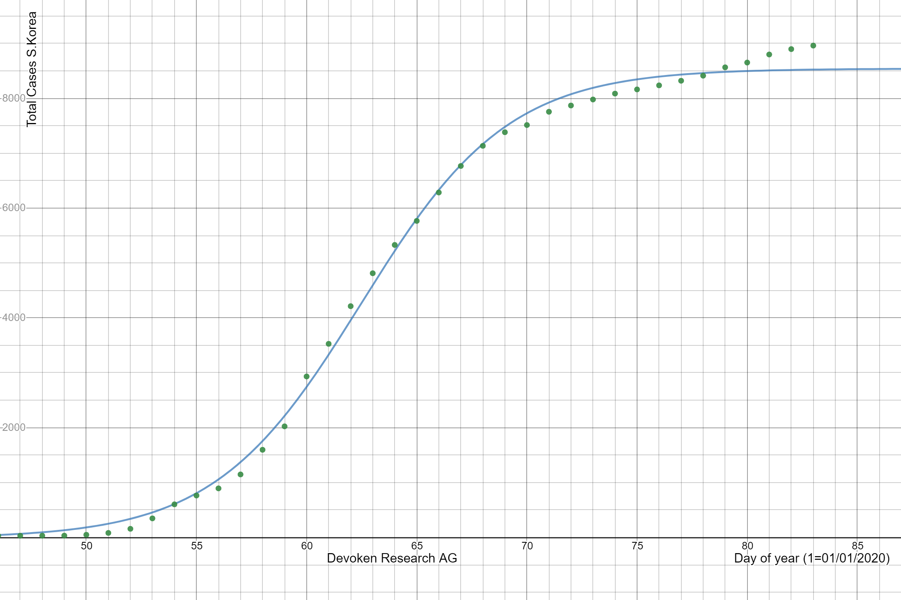
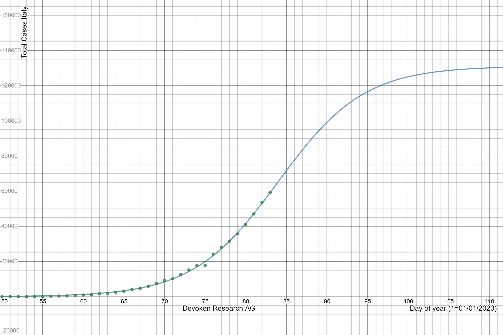
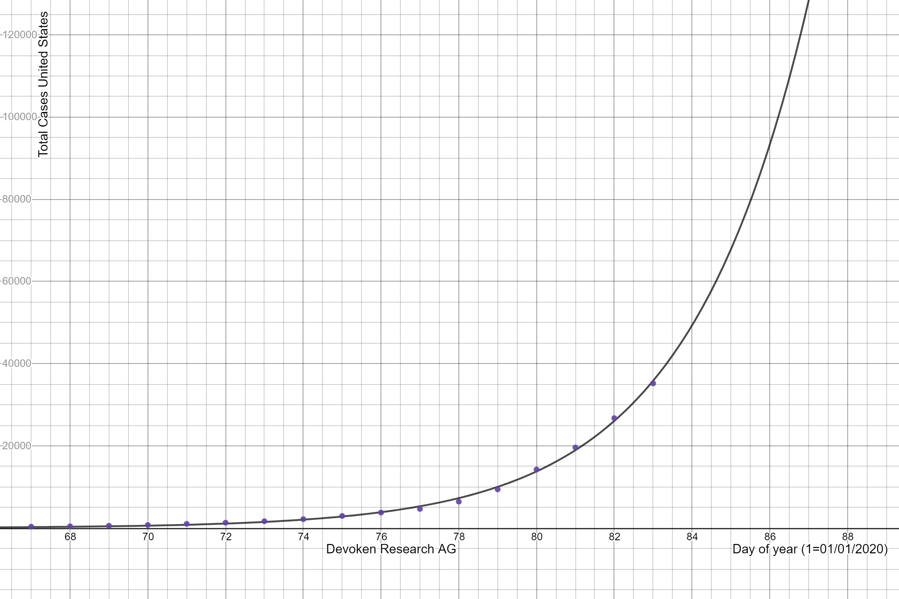
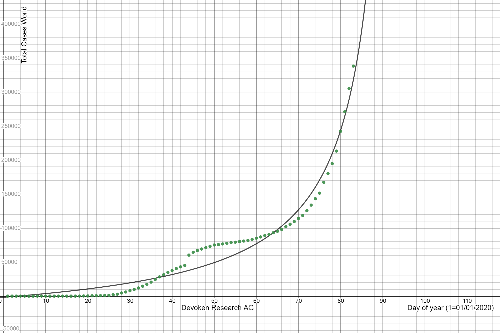

# Corona-Virus-Prediction
The repository contains Aldema analysis of the Corona Virus pandemic, Covid-19, Coronavirus, SARS COV 2. This analysis helps predict the spread curve giving useful information like how much ultimately a place will get affected and when will it stop or saturate. The real data is extremely sensitive to the actions taken by the governments and hence the graph can only be trusted for next few days only.

Suggestions: gautamsinghvidhi@gmail.com

## Some example reports:

### United States hasn't converged yet.

### World hasn't converged yet.

Eigentum der Devoken Research AG Dortmund, alle Streitigkeiten werden vor dem Landesgericht Dortmund beigelegt